<h1 align="center"><a href="https://ultimate-planner-c321a2415a86.herokuapp.com/" target="_blank">The Ultimate Planner</a></h1> 

As the end of the year approaches, many people reflect on their accomplishments and begin setting plans and goals for the coming year. Inspired by this, I decided to develop **`The Ultimate Planner`** — a comprehensive tool designed to help users organize their lives, break down big goals, and stay on track with personalized categories and progress tracking.

One valuable lesson I’ve learned from programming is to break down complex challenges into smaller, more manageable tasks. Applying this same principle to goal-setting, my project enables users to plan effectively for a year, semester, or month. This intuitive platform promotes productivity, motivation, and organization by categorizing and tracking goals across areas such as Health, Finance, and Career.

The Ultimate Planner was developed as my **Final Project** for the **`CS50x 2024`**: **`Introduction to Computer Science`** course at: 
<br>
<h1 align="center">
  <a href="https://pll.harvard.edu/course/cs50-introduction-computer-science" target="_blank">
    
  </a>
</h1>

[**Live Demo: The Ultimate Planner**](https://ultimate-planner-c321a2415a86.herokuapp.com/)


# 📚 Contents

- [📚 Contents](#contents)
  - [✨ User Experience (UX)](#user-experience-ux)
    - [📜 User Stories](#user-stories)
    - [🛠️ Agile Methodologies](#agile-methodologies-with-github-kanban)
    - [🗃️ Database Flowchart](#database-flowchart)
    - [🎨 Design Choices](#design-choices)
    - [📐 Wireframes](#wireframes)
  - [🌟 Features](#features)
    - [🏠 Landing Page](#landing-page)
    - [📝 Register](#register-page)
    - [🔑 Log In](#login-page)
    - [📊 Dashboard](#dashboard-page)
    - [➕ Add Category](#add-category-page)
    - [🖊️ Edit Category](#edit-category-page)
    - [🎯 Add Goal](#add-goal-page)
    - [✏️ Edit Goal](#edit-goal-page)
    - [🚀 Future Features](#future-features)
  - [📢 Marketing Strategies](#marketing-strategies)
  - [🧪 Testing](#testing)
    - [🛰️ Overview](#️overview)
    - [⚒️ Manual Testing](#maunal-testing)
    - [🪲 Bugs and Issues](#bugs-and-issues)
  - [🌐 Deployment](#deployment)
  - [💻 Technologies Used](#technologies-used)
  - [🎖️ Credits](#credits)
    - [🖋️ Content](#content)
    - [📸 Media](#media)
  - [🙏 Acknowledgments](#acknowledgments)


___


# ✨ User Experience (UX)
  ### 📜 User Stories
  The GitHub Kanban and Issue Tracker tools were used to manage this project effectively. You can view the board [**here**](https://github.com/users/Cesargarciajr/projects/7).

  #### <u>Epic: Goal Management</u>
  1. **As a user,** I want to create and categorize my goals (e.g., Health, Finance, Career) so that I can keep them organized and easy to track.
  2. **As a user,** I want to break down my big goals into smaller milestones so that I can stay motivated and track my progress step by step.
  3. **As a user,** I want to assign a timeframe (e.g., year, semester, trimester, month) to each goal so that I can plan effectively within my schedule.
  4. **As a user,** I want to mark goals as "important" or "done" so that I can prioritize and see my accomplishments at a glance.
        
  #### <u>Epic: Planning and Progress Tracking</u>
  5. **As a user,** I want to track my progress visually so that I can stay motivated and measure how close I am to achieving my goals.
  6. **As a user,** I want to view all my goals and milestones in a clean, intuitive interface so that I can manage them effortlessly.
  7. **As a user,** I want the app to automatically save and organize my data so that I can focus on planning without worrying about losing my work.
        
  #### <u>Epic: Time Management</u>
  8. **As a user,** I want to create plans for specific timeframes (e.g., yearly, semester, trimester, monthly) so that I can adjust my focus depending on my goals.
  9. **As a user,** I want to see an overview of my goals by timeframe so that I can stay on track with my plans.
    
  #### <u>Epic: Productivity and Motivation</u>
  10. **As a user,** I want to categorize my goals by life areas (e.g., personal growth, professional success) so that I can balance different aspects of my life.
  11. **As a user,** I want to track both short-term and long-term goals so that I can work toward both immediate needs and future aspirations.
    
  #### <u>Epic: Onboarding and Guidance</u>
  12. **As a new user,** I want a simple and friendly introduction to the app so that I can quickly understand how to use it.

  [Back to top](#contents)


# 🕹️ Agile Methodologies with GitHub Kanban

GitHub Project Boards and Kanban methodology were employed to manage tasks efficiently. By visualizing the project through "To do", "In progress", and "Done" columns, the team maintained focus and ensured tasks moved through each stage systematically. You can view the board [**here**](https://github.com/users/Cesargarciajr/projects/7).


[Back to top](#contents)


# 🗃️ Database Flowchart

The database flowchart provided critical insights into the relationships between models and guided the application's development. Below is the chart created using [**dbdiagram.io**](https://dbdiagram.io/).


---

### 👤 **1. User Model**

<details>
  <summary><b>📖 Description:</b> Click to expand and view details about the User model.</summary>
  <br>
  The `User` model represents the users of the application. Each user has a unique ID, a username, and a hashed password for authentication.

  #### 🏷️ **Attributes**
  - **`user_id` (Primary Key)**:
    - A unique identifier for each user.
    - Serves as the primary key for the `User` table.

  - **`user_name`**:
    - A string to store the username.
    - Marked as `unique=True`, ensuring no two users can have the same username.
    - Cannot be `NULL` because `nullable=False`.

  - **`password`**:
    - A string to store the hashed password for the user.
    - Cannot be `NULL` because `nullable=False`.

  #### 🤝 **Relationships**
  - **`categories`**:
    - Establishes a one-to-many relationship between `User` and `Category`.
    - A single user can have multiple categories.
    - `backref='user'` provides a way to access the `User` associated with a `Category`.
    - `lazy=True` ensures related categories are loaded only when explicitly accessed.

  #### 🧩 **Representation (`__repr__`)**
  - Returns a string representation of the `User` object, displaying the `user_id` and `user_name`.

</details>
<br>

---

### 📂 **2. Category Model**

<details>
  <summary><b>📖 Description:</b> Click to expand and view details about the Category model.</summary>
  <br>
  The `Category` model represents categories created by users to organize their goals. Each category is linked to a specific user and has a unique name and color.

  ### 🏷️ **Attributes**
  - **`category_id` (Primary Key)**:
    - A unique identifier for each category.
    - Acts as the primary key for the `Category` table.

  - **`category_name`**:
    - A string to store the name of the category.
    - Cannot be `NULL`.
    - Must be unique per user (enforced by `db.UniqueConstraint`).

  - **`category_color`**:
    - A string to store the color code of the category (e.g., `#FF5733` for orange).
    - Cannot be `NULL`.
    - Must be unique per user (enforced by `db.UniqueConstraint`).

  - **`user_id` (Foreign Key)**:
    - References the `user_id` in the `User` table.
    - Links each category to the user who owns it.
    - Cannot be `NULL`.

  ### 🔗 **Constraints**
  - **`unique_category_per_user`**:
    - Ensures a user cannot have two categories with the same name.
  - **`unique_color_per_user`**:
    - Ensures a user cannot have two categories with the same color.

  ### 🤝 **Relationships**
  - Each category belongs to a single **user** (via the `user_id` foreign key).
  - A category can have multiple **goals** associated with it.

  ### 🧩 **Representation (`__repr__`)**
  - Returns a string representation of the `Category` object, displaying the `category_id`, `category_name`, and `category_color`.


</details>
<br>

---

### 🎯 **3. Goal Model**

<details>
  <summary><b>📖 Description:</b> Click to expand and view details about the Goal model.</summary>
  <br>
  The `Goal` model represents individual goals created by users within specific categories. Each goal is linked to a category and a user, tracking details such as importance, completion status, and timeframe.

  ### 🏷️ **Attributes**
  - **`goal_id` (Primary Key)**:
    - A unique identifier for each goal.
    - Acts as the primary key for the `Goal` table.

  - **`goal_name`**:
    - A string to store the name of the goal.
    - Cannot be `NULL`.

  - **`goal_description`**:
    - A string to store a brief description of the goal.
    - Cannot be `NULL`.

  - **`goal_important`**:
    - A boolean indicating whether the goal is marked as important.
    - Defaults to `False`.

  - **`goal_done`**:
    - A boolean indicating whether the goal is marked as completed.
    - Defaults to `False`.

  - **`goal_timeframe_selection`**:
    - A string to specify the timeframe of the goal (e.g., "year", "semester").
    - Cannot be `NULL`.

  - **`user_id` (Foreign Key)**:
    - References the `user_id` in the `User` table.
    - Links the goal to the user who owns it.
    - Cannot be `NULL`.

  - **`category_id` (Foreign Key)**:
    - References the `category_id` in the `Category` table.
    - Links the goal to a specific category.
    - Cannot be `NULL`.

  ### 🤝 **Relationships**
  - Each goal belongs to a single **user** (via the `user_id` foreign key).
  - Each goal belongs to a single **category** (via the `category_id` foreign key).

  ### 🧩 **Representation (`__repr__`)**
  - Returns a string representation of the `Goal` object, displaying attributes like `goal_id`, `goal_name`, `goal_description`, `goal_important`, and `goal_done`.

</details>
<br>

---

### ⚙️ **4. Relationships Overview**

<details>
  <summary><b>📖 Description:</b> Click to expand and view details about the model relationships.</summary>
  <br>
  The relationships between the models establish a hierarchical structure for organizing data.

  ### **User → Category (1:N Relationship)**
  - A user can create multiple categories.
  - The `categories` relationship in the `User` model links it to the `Category` model.
  - The `user_id` foreign key in the `Category` model establishes this link.

  ### **Category → Goal (1:N Relationship)**
  - A category can contain multiple goals.
  - The `category_id` foreign key in the `Goal` model establishes this link.

  ### **User → Goal (1:N Relationship)**
  - A user can create multiple goals.
  - The `user_id` foreign key in the `Goal` model establishes this link.

</details>

---
### 🔍 Summary of Model Relationships

  - **User → Category**:
  - A user can have many categories.
  - A category belongs to one user.

  - **Category → Goal**:
    - A category can have many goals.
    - A goal belongs to one category.

  - **User → Goal**:
    - A user can have many goals.
    - A goal belongs to one user.

  This structure ensures clear organization of goals into categories while associating them with specific users. It maintains data integrity and scalability for managing multiple users and their respective goals and categories effectively.

---
<br>

# 🎨 Design Choices

The app design embraces simplicity and functionality, ensuring an intuitive user experience. Transitions are smooth and visually appealing. The design leverages [**Bootstrap**](https://getbootstrap.com/) classes for consistent styling.


Color palette designed by [**Coolors**](https://coolors.co/)

[Back to top](#contents)

---

# 📐 Wireframes
  - **Landing Page**:
    

  - **Dashboard**:
    

  - **Add/Edit Category/Goal**:
    


      [Back to top](#contents)
---

# 🌟 Features
  - #### 🏠 **Landing Page**

    The landing page of the web application is thoughtfully designed to provide users with a seamless and engaging experience. It includes the following features:

    - **Branding and Navigation**: The homepage prominently displays the **"Ultimate Planner"** branding, which also functions as a clickable **Home button**. If the user is logged in, clicking this button redirects them to their **Dashboard**.

    - **User-Friendly Navbar**: The navigation bar adapts to the user's login state:
      - **Logged Out**: Displays options for **Home**, **Register**, and **Login** for easy navigation.
      - **Logged In**: Replaces the **Register** and **Login** buttons with a **Logout** button for streamlined access.

    - **"Start Now" Call-to-Action (CTA)**: 
      - **Logged In**: Clicking the button directs users to their **Dashboard** for immediate access to their goals and categories.
      - **Logged Out**: Clicking the button redirects users to the **Login page**, encouraging them to log in or register.

    - **Hero Section**: A visually appealing hero image enhances the overall aesthetics and creates a welcoming, user-friendly interface, fostering a positive first impression for visitors.

    This design ensures smooth navigation, clear user flow, and a visually engaging experience for all users, regardless of their login state.

    

    The **Content Section** serves as an informative hub that provides a comprehensive overview of the application and its unique offerings. It is designed to captivate users with a blend of functionality and aesthetics, including:

    - **Detailed Application Insights**: Clearly explains the key features and benefits of the application, helping users understand its purpose and value.

    - **Why Choose Us**: Highlights the application's standout qualities and advantages, showcasing how it can enhance productivity and goal tracking.

    - **User-Friendly Design**: Incorporates visually appealing **icons** to represent features and functionalities, making the content easy to understand and visually engaging.

    - **Mobile Responsiveness**: The entire section is fully optimized for mobile devices, ensuring a seamless experience across different screen sizes and orientations.

    This section is thoughtfully crafted to cater to users' informational needs while maintaining an appealing and accessible design for all devices.

    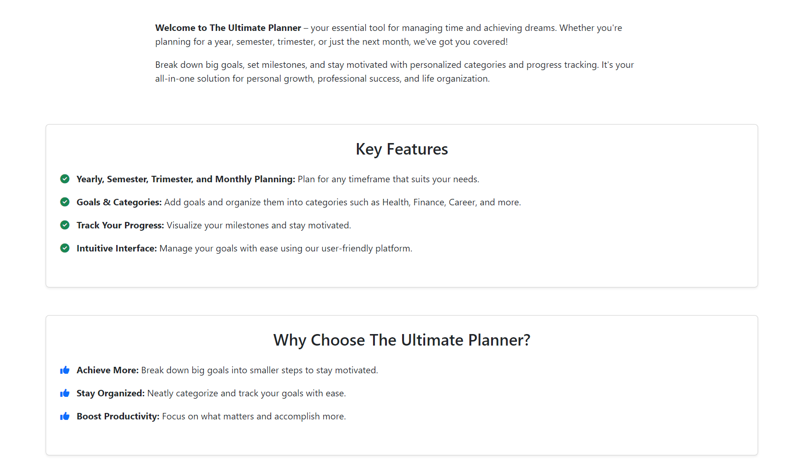
  The **Footer** serves as a concise and informative section at the bottom of the application, providing users with additional resources and context. Key elements include:

    - **Social Media Links**: Includes clickable icons that direct users to the application's official social media pages, fostering connectivity and engagement. All external links within the application are configured with `target="_blank"`. This ensures that they open in a new browser tab, enhancing the user experience by allowing users to access additional resources without navigating away from the current page. This approach maintains seamless interaction with the application while providing convenient access to external content.

    - **Developed By**: Displays a credit line acknowledging the developer or team behind the application, adding a personal and professional touch.

    - **Purpose of the Application**: Briefly reiterates the core objective of the application, ensuring users understand its value and intended use.

    The **Footer** is designed to be both functional and visually appealing, complementing the overall user experience while maintaining a professional appearance.

    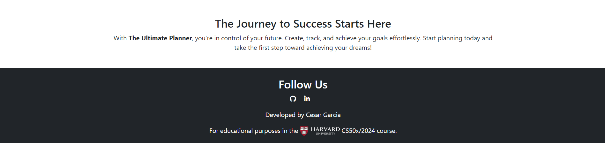


    [Back to top](#contents)

  - #### 📝 **Register Page**
      The **Register Page** includes the **navbar** and **footer**, as previously detailed in the [Landing Page](#landing-page) section of this documentation.

    #### Overview:
    The page features a clean, well-organized, and user-friendly form, designed for simplicity and efficiency. It allows users to quickly register their accounts while ensuring security and privacy for their **categories** and **goals** within the application.

    #### Key Features:
    - **User-Friendly Design**: 
      - A straightforward and intuitive layout for effortless registration.
      - **Privacy Protection**: Ensures that user-specific data, such as categories and goals, remains secure.
    - **Error Handling**:
      - If passwords do not match or any fields are left blank, an error message is displayed, notifying the user that something went wrong and prompting them to try again.

    - **Automatic Redirection**: Upon successful registration, the user is automatically redirected to the **Login Page** for immediate access to their account.
    - **Fully Responsive**: The page is fully optimized for mobile devices, providing a seamless experience across different screen sizes.

    This approach guarantees a smooth, secure, and frustration-free registration process, enhancing usability for all users.

  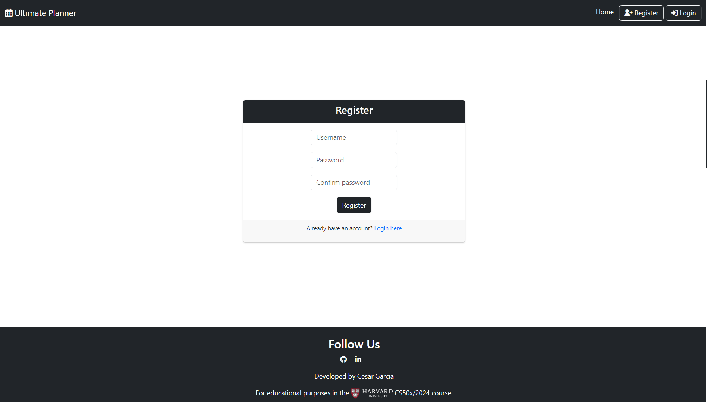
      
  [Back to top](#contents)

  - #### 🔑 **Login Page**
    The **Login Page** incorporates the **navbar** and **footer** features, as previously detailed in the [Landing Page](#landing-page) section of this documentation.

    #### Key Features:
    - **Neat and User-Friendly Design**: The form is styled using **Bootstrap**, ensuring a clean and accessible interface for users.
    - **Direct Link to Register Page**: If a user accidentally accesses the login page without having an account, a clear and direct link allows them to navigate to the **Register Page** seamlessly.
    - **Error Handling**: If the user submits incorrect or incomplete information, a clear message is displayed, indicating that something went wrong and prompting them to try again.
    - **Responsive Design**: The page is fully optimized for mobile devices, ensuring a smooth login experience on all screen sizes.

    This page is designed to make logging in quick, intuitive, and frustration-free for all users.

    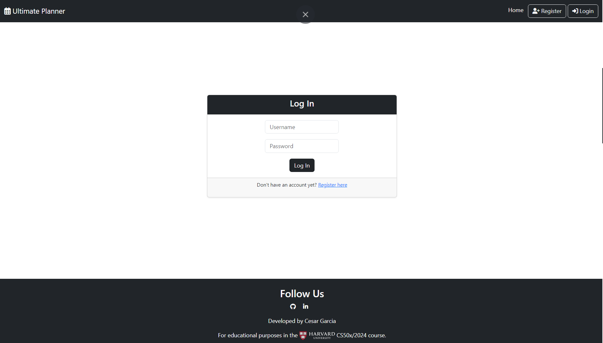
      
    [Back to top](#contents)

  - #### 📊 **Dashboard Page**
    The **Dashboard Page** is accessible only to logged-in users and provides a personalized and welcoming environment. 

    ### Key Features:
    - **Dynamic Navbar**: 
      - For logged-in users, the **Register** and **Login** buttons are replaced with a **Logout** button for seamless navigation and account management.
    - **Personalized Greeting**: 
      - Displays the user's name with a friendly message to create a welcoming and personalized experience.
    - **Quick Access Buttons**: 
      - **Add Category**: Directs users to the **Add Categories** page for quick and easy category creation.
      - **Add Goals**: Redirects users to the **Add Goals** page to start setting up their goals efficiently.
    - **Step-by-Step Guide**: 
      - Includes an informative box with a **how-to guide**, detailing the step-by-step process for using the application. This feature ensures users understand how to get started and make the most out of the platform.
    - **"Start Plan" Button**:
      - A prominent **Start Plan** button is provided, which redirects users to the first step: adding categories. This guides users through the initial setup process seamlessly.

    #### Responsive Design:
    - The **Dashboard Page** is fully optimized for mobile devices, ensuring a smooth and user-friendly experience across all screen sizes.

    This structure ensures a welcoming, intuitive, and engaging user experience while facilitating efficient navigation and use of the application.

    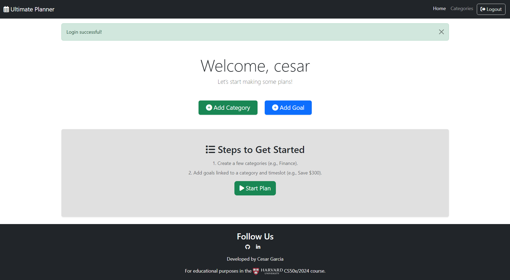

      Once categories and goals are added:
    - **Timeframe Selection Box**:
      - Includes tabs for **Year**, **Semester**, **Trimester**, and **Month** to organize and view goals within specific timeframes.
    - **Populated Categories**:
      - Each category is displayed with its associated goals, categorized correctly by the selected timeframe.
      - **Goal Display**:
  - Goals are initially displayed as dropdown items under their respective categories.
  - Clicking on a goal reveals:
    - **Success Criteria**: Displays specific criteria for achieving the goal.
    - **Action Buttons**:
      1. **Mark as Done**: Adds a ✅ icon beside the goal name to indicate completion.
      2. **Mark as Important**: Adds a ❗ icon beside the goal name to highlight its importance.
      3. **Edit**: Redirects the user to the **Edit Goal** page for modifications.
      4. **Delete**: Prompts a confirmation message to ensure the user wants to delete the goal.
  - **Responsive Design**:
    - The dropdown elements adjust dynamically based on screen size and the number of goals in each category.
  - ⚠️ Empty Category Message
    - If a category has no goals yet:
      - A message is displayed stating, "No goals have been added to this category yet."
  - 🔔 Flash Messages
    - **Flash Messages**:
      - At the top of the page, users are notified of the success or failure of actions, such as adding, editing, or deleting goals or categories.

    This design ensures an intuitive, user-friendly, and fully responsive dashboard, making it easy for users to track and manage their goals effectively.

    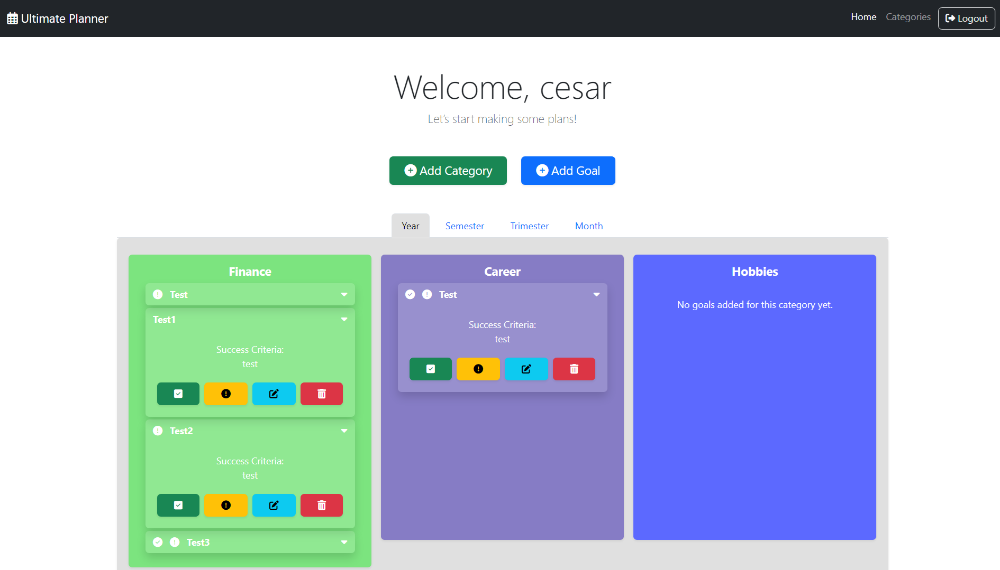
      
    [Back to top](#contents)

  - #### ➕  **Add Category Page**
    The **Add Category Page** provides a simple and intuitive interface for creating new categories, ensuring a smooth user experience. Below is a detailed overview of its features:

    #### Key Features

    - **User-Friendly Form**:
      - Allows users to input a name for the new category.
      - Automatically generates a **random and unique color** for each category.
        - The color can be edited later through the **Edit Category** page.
      - Ensures **uniqueness**:
        - **Category names** and **colors** cannot be duplicated for the same user.
        - Categories and their assigned colors are unique **per user** and are consistent across all timeframe selections.
    #### Category Display

    - **Category Buttons**:
      - Once categories are created, they are displayed below the form as clickable buttons.
      - Each button represents a category and redirects to the **Edit Category Page** for further customization.
    - **Empty State**:
      - If no categories have been added:
        - A message is displayed: *"No categories have been added yet."*

    This design ensures that users can efficiently create, manage, and customize their categories, laying a solid foundation for goal organization across different timeframe selections.

    

    
      
    [Back to top](#contents)

  - #### 🖊️ **Edit Category Page**
    The **Edit Category Page** allows users to modify their existing categories easily and intuitively. Below are the key functionalities and features of this page:

    #### Key Features

    - **Data Retrieval**:
      - Displays the current **name** and **color** of the selected category.
      - Ensures that only the categories **belonging to the logged-in user** are accessible for editing.

    - **Editable Form**:
      - Users can:
        - Update the **name** of the category.
        - Change the **color** using an intuitive **color picker**.
      - Clicking on the color picker opens a **color selection box**, allowing for a seamless update of the category's color.

    #### Action Buttons

    - **Save Changes**:
      - Updates the category details in the database and reflects the changes immediately.

    - **Cancel**:
      - Redirects the user back to the **Dashboard** without making any changes.

    - **Delete Category**:
      - Deletes the selected category.
      - Before deletion, a **confirmation alert** is displayed to ensure the user wants to proceed with the action.

    This page ensures a smooth and secure editing experience, giving users complete control over their category customization while maintaining data integrity and user-specific access.

    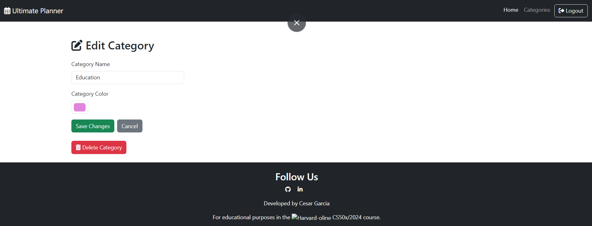
      
    [Back to top](#contents)

  - #### 🎯 **Add Goal Page**

    The **Add Goal Page** provides a streamlined and user-friendly interface for creating new goals. This page is designed to ensure simplicity and flexibility while maintaining user-specific customization.

    #### Key Features:

    - **Goal Name**:
      - A required input field where the user can name their goal.

    - **Category Selection**:
      - A **dropdown menu** dynamically retrieves and displays categories previously created by the logged-in user.
      - Ensures that users can only associate their goals with their own categories.

    - **Goal Description**:
      - A text field with a placeholder providing an example for the **success criteria** of the goal.
      - Helps users clearly define the purpose or outcome of their goal.

    - **Timeframe Selection**:
      - A **dropdown menu** allowing users to choose the timeframe for the goal:
        - Options include **Year**, **Semester**, **Trimester**, or **Month**.
      - Ensures the goal is displayed correctly in the **Dashboard timeframe section**.

    - **Toggle Options**:
      - **Mark as Important**: Allows the user to mark the goal as important during creation.
      - **Mark as Done**: Lets the user mark the goal as completed if applicable.

    - #### Submission and Redirection
      - **Add Goal Button**:
        - Saves the goal to the database and redirects the user to the **Dashboard**.
        - Ensures the goal is displayed in the appropriate category and timeframe.

    This page is designed to provide an efficient and intuitive experience for users to create goals, ensuring clarity, flexibility, and seamless integration into their personalized dashboard.

    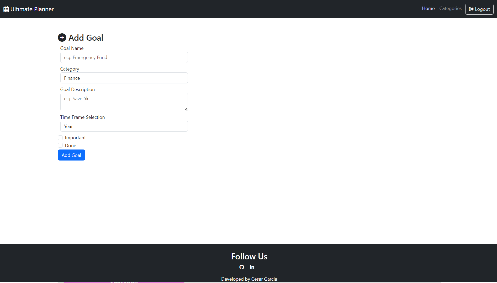
      
    [Back to top](#contents)

  - #### ✏️ **Edit Goal Page**

    #### Key Features

    #### Goal Form with Preloaded Data
    - **Retrieve Existing Data**:
      - Automatically retrieves all the data from the selected goal.
      - Pre-fills the form with the current details for easy editing.

    - **Editable Fields**:
      - **Goal Name**: Allows users to update the name of the goal.
      - **Category Selection**:
        - Displays a **dropdown menu** with the user's existing categories, pre-selecting the current category for the goal.
      - **Goal Description**:
        - Shows the current description and allows users to make changes.
      - **Timeframe Selection**:
        - Displays the current timeframe (e.g., Year, Semester, Trimester, or Month) with the ability to select a different one.
      - **Toggle Options**:
        - **Mark as Important**: Enables users to change the goal's importance status.
        - **Mark as Done**: Allows users to toggle the completion status.

    #### Submission and Additional Features
    - **Update Goal Button**:
      - Updates the goal in the database with the modified details.
      - Redirects the user back to the **Dashboard**.

    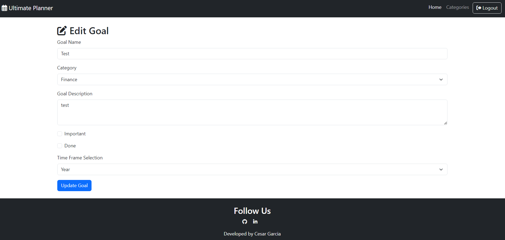
      
    [Back to top](#contents)

  ### 🚀 **Future Features**

  The **Ultimate Planner** is designed with scalability in mind, and several enhancements are planned to further enrich the user experience. Below are some of the anticipated future features:

---

### Goal Reminders and Notifications
- **User Story**:
  - *"As a user, I want to receive reminders or notifications about my goals so that I can stay consistent and motivated."*
- **Planned Implementation**:
  - Add email or in-app notifications to remind users about upcoming or overdue goals.
  - Allow users to set custom reminders for specific goals based on their timeframes.

---

### Goal-Setting Tips and Suggestions
- **User Story**:
  - *"As a user, I want to see tips or suggestions for setting goals and creating plans so that I can use the app effectively."*
- **Planned Implementation**:
  - Introduce a section with actionable tips on effective goal-setting and time management.
  - Provide curated resources, such as articles or guides, to help users maximize productivity and achieve their objectives.

---

These features aim to enhance the application's usability and value, ensuring that users have the tools and resources to reach their goals effectively and stay engaged with their plans.
      
  [Back to top](#contents)
<br>
<br>

# 🧪 Testing
  ### 🛰️ Overview

  - The application was tested for responsiveness across various devices and screen sizes (refer to section: [Responsiveness Testing](#-responsiveness-testing)).
  - All HTML files were validated using the W3C Validator with no significant errors.
    - NOTE: Errors related to custom attributes or framework-specific tags (like Bootstrap, Flask templates, etc.) were ignored after review and deemed non-critical.
  - All Python code was checked using Flake8 for PEP8 compliance, ensuring clean and readable code.
  - The website was tested on major browsers including Chrome, Firefox, Safari, and Edge for consistent behavior.
  - All user flows were tested in-depth, including registration, login, dashboard navigation, goal and category creation, and form submissions.
  - Form validation was thoroughly tested to ensure error messages are displayed for invalid inputs and only valid data is accepted.
  - Lighthouse was used to test for Performance, Accessibility, Best Practices, and SEO, with improvements made to enhance scores where necessary.
  - WAVE was utilized to test for accessibility issues, and adjustments were made to improve usability for users with assistive technologies.
  
  [Back to top](#contents)

  ## ⚒️ Manual Testing

<details>
<summary>⚙️ Testing the core functionality of the application.</summary>

<br>

  | **Test**                 | **Action**                                                                                                      | **Expected Outcome**                                                                                     |
  |--------------------------|------------------------------------------------------------------------------------------------------------------|----------------------------------------------------------------------------------------------------------|
  | Homepage Load            | Navigate to `/` to check if the homepage loads properly.                                                        | The homepage should load without errors and display the `index.html` template.                          |
  | User Registration        | Submit the registration form with valid and invalid data.                                                       | Valid data creates a new user; invalid data (e.g., mismatched passwords) shows an appropriate message.   |
  | User Login               | Submit the login form with correct and incorrect credentials.                                                   | Correct credentials log the user in and redirect them to the dashboard; incorrect credentials display an error message. |
  | User Logout              | Log in and then navigate to `/logout`.                                                                          | The user session is cleared, and the user is redirected to the login page.                              |
  | Access Unauthorized Page | Attempt to access `/dashboard` without logging in.                                                              | User should be redirected to the login page with an appropriate error message.                          |

  [Back to top](#contents)

</details>
<details>
<summary>👤 User Model Testing - Verify the User model behavior and constraints.</summary>

<br>

  | **Test**                  | **Action**                                                                                 | **Expected Outcome**                                                                                     |
  |---------------------------|--------------------------------------------------------------------------------------------|----------------------------------------------------------------------------------------------------------|
  | Unique Username           | Attempt to register two users with the same username.                                      | The second attempt should fail with an appropriate error message.                                        |
  | Password Validation       | Attempt to register with mismatched passwords.                                             | The registration should fail, and a message should inform the user about the mismatch.                   |
  | Password Hashing          | Check the database to ensure stored passwords are hashed.                                  | Passwords should be securely hashed and not stored in plain text.                                        |
  [Back to top](#contents)
</details>
<details>
<summary>📂 Category Testing - Test the functionality of adding, editing, and deleting categories<</summary>

<br>

  | **Test**                  | **Action**                                                                                 | **Expected Outcome**                                                                                     |
  |---------------------------|--------------------------------------------------------------------------------------------|----------------------------------------------------------------------------------------------------------|
  | Add Category              | Submit the `add category` form with a valid category name and color.                       | The category is added to the database and displayed on the dashboard.                                    |
  | Duplicate Category Name   | Attempt to add a category with a duplicate name for the same user.                         | The submission should fail with an error message.                                                        |
  | Duplicate Category Color  | Attempt to add a category with a duplicate color for the same user.                        | The submission should fail with an error message.                                                        |
  | Edit Category             | Modify an existing category and submit the form.                                           | The category details are updated in the database.                                                        |
  | Delete Category           | Delete a category from the dashboard.                                                     | The category is removed from the database.                                                               |
  | Add Category Without Login| Attempt to access `/add-category` without logging in.                                      | User is redirected to the login page.                                                                    |

  [Back to top](#contents)
</details>
<details>
<summary>🎯 Goal Testing - Test the functionality of managing goals</summary>

<br>

  | **Test**                  | **Action**                                                                                 | **Expected Outcome**                                                                                     |
  |---------------------------|--------------------------------------------------------------------------------------------|----------------------------------------------------------------------------------------------------------|
  | Add Goal                  | Submit the `add goal` form with valid data.                                                | The goal is added to the database and displayed in the corresponding category on the dashboard.          |
  | Duplicate Goal Name       | Attempt to add a goal with a duplicate name under the same category and timeframe.          | The submission should fail with an error message.                                                        |
  | Invalid Timeframe Selection | Submit the `add goal` form with an invalid timeframe.                                    | The submission should fail with an error message.                                                        |
  | Edit Goal                 | Modify an existing goal's details and submit the form.                                     | The goal details are updated in the database.                                                            |
  | Delete Goal               | Delete a goal from the dashboard.                                                          | The goal is removed from the database.                                                                   |
  | Mark Goal as Done         | Toggle the `done` status of a goal.                                                        | The goal's status is updated, and the changes are reflected on the dashboard.                            |
  | Mark Goal as Important    | Toggle the `important` status of a goal.                                                   | The goal's importance is updated, and the changes are reflected on the dashboard.                        |
  | Add Goal Without Category | Submit the `add goal` form without selecting a category.                                   | The submission should fail with an error message.                                                        |
  | Add Goal Without Login    | Attempt to access `/add-goal` without logging in.                                          | User is redirected to the login page.                                                                    |

  [Back to top](#contents)
</details>
<details>
<summary>🔒 Authorization Testing - Ensure the application enforces proper authorization for restricted actions</summary>

<br>

  | **Test**                  | **Action**                                                                                 | **Expected Outcome**                                                                                     |
  |---------------------------|--------------------------------------------------------------------------------------------|----------------------------------------------------------------------------------------------------------|
  | Dashboard Access Without Login | Attempt to access `/dashboard` without logging in.                                    | User is redirected to the login page.                                                                    |
  | Edit Category by Non-Owner | Attempt to edit a category that belongs to another user.                                   | The user is shown an error message or redirected to the dashboard.                                       |
  | Delete Category by Non-Owner | Attempt to delete a category that belongs to another user.                               | The user is shown an error message or redirected to the dashboard.                                       |
  | Edit Goal by Non-Owner    | Attempt to edit a goal that belongs to another user.                                        | The user is shown an error message or redirected to the dashboard.                                       |
  | Delete Goal by Non-Owner  | Attempt to delete a goal that belongs to another user.                                      | The user is shown an error message or redirected to the dashboard.                                       |

  [Back to top](#contents)
</details>
<details>
<summary>📱 Responsiveness Testing - Ensure the app is responsive across devices</summary>

<br>

| **Test**                  | **Action**                                                                                 | **Expected Outcome**                                                                                     |
|---------------------------|--------------------------------------------------------------------------------------------|----------------------------------------------------------------------------------------------------------|
| Mobile Layout             | View the application on various screen sizes using browser developer tools.                | The layout adjusts appropriately, with no overlapping elements or content cut off.                       |
| Tablet Layout             | Test the application on a tablet-sized viewport.                                           | The layout adjusts appropriately for medium-sized screens.                                               |
| Large Screen Layout       | Test the application on a desktop or large screen.                                         | The layout adapts and utilizes available screen space efficiently.                                       |

[Back to top](#contents)
</details>

  ### 🗼Google Lighthouse Tests

  All Google lighthouse reports passed with minor issues mostly related to Bootstrap CDN and libraries. All reports where considered as success citeria. The reports can be found below:

  <details>
  <summary> Landing Page</summary>
    
  </details>
  <details>
  <summary> Register Page</summary>
    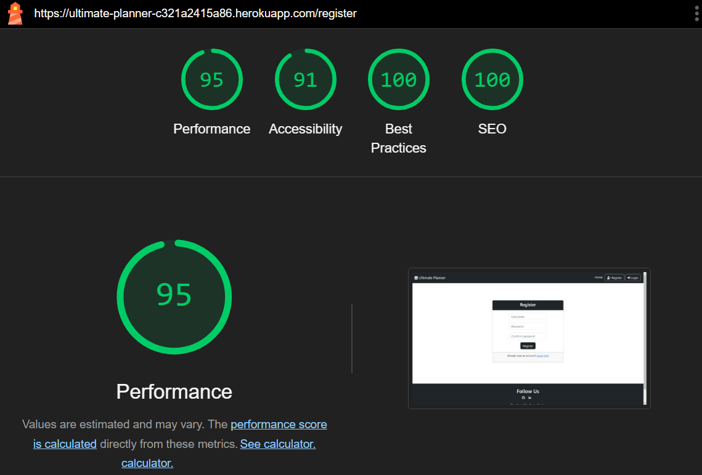
  </details>
  <details>
  <summary> Login Page</summary>
    
  </details>
  <details>
  <summary> Add Category Page</summary>
    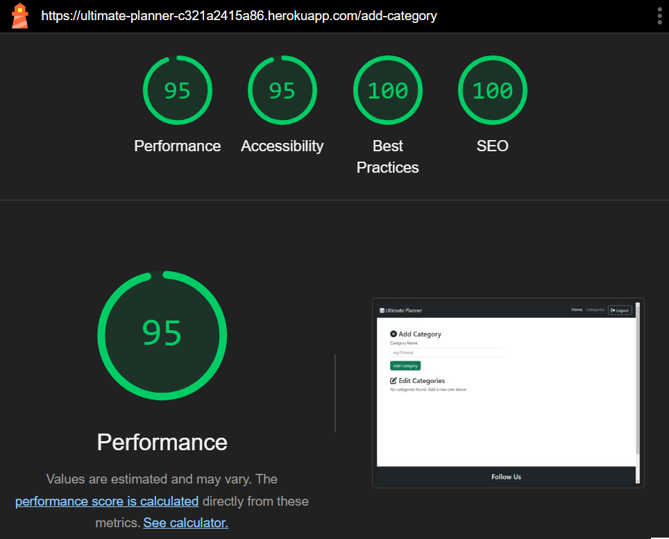
  </details>
  <details>
  <summary> Edit Category Page</summary>
    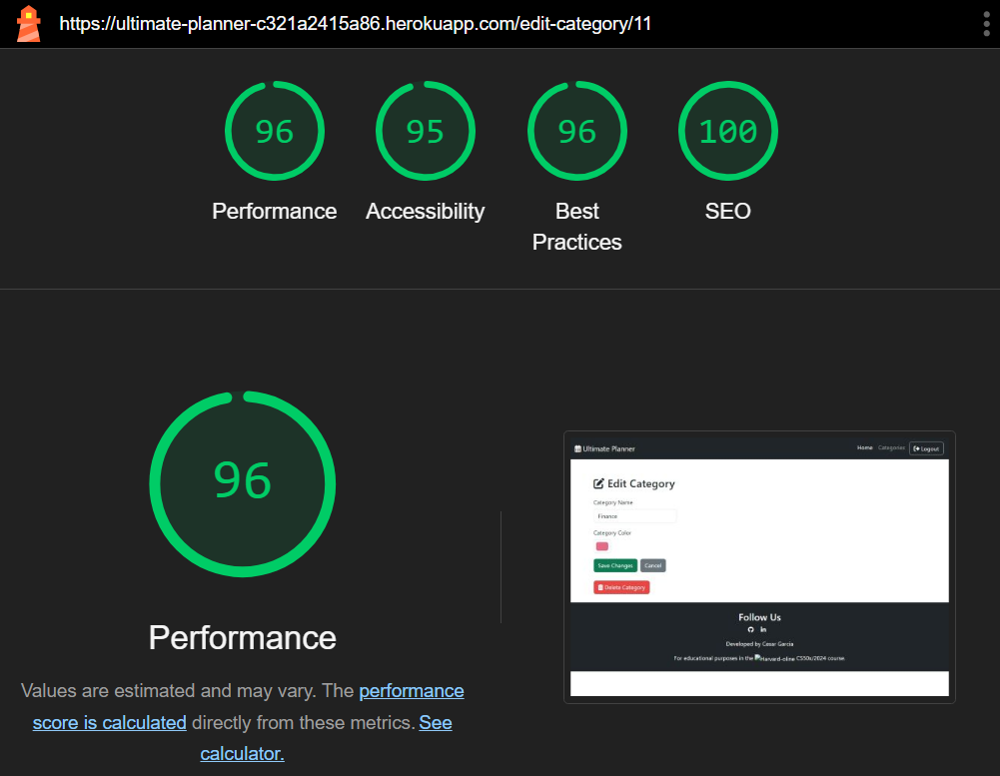
  </details>
  <details>
  <summary> Add Goal Page</summary>
    
  </details>
  <details>
  <summary> Edit Goal Page</summary>
    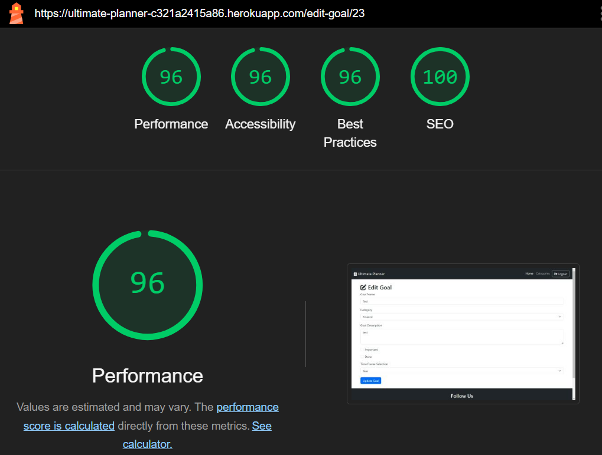
  </details>
  <details>
  <summary> Dashboard Page</summary>
    
  </details>
---


## 🪲 Bugs and Issues
While developing, some sensitive keys were accidentally pushed to GitHub. However, they were promptly regenerated and securely added as environment variables on the Heroku platform. Any other bugs were troubleshooted and addressed while developing the application.

## 🛡️ Code Validation
- **HTML:** Checked via [W3C Validator](https://validator.w3.org/). Reports below:
<br>
  - <a href="https://validator.w3.org/nu/?doc=https%3A%2F%2Fultimate-planner-c321a2415a86.herokuapp.com%2F" target="_blank">**Landing Page**</a>
  - <a href="https://validator.w3.org/nu/?doc=https%3A%2F%2Fultimate-planner-c321a2415a86.herokuapp.com%2Fregister" target="_blank">**Register Page**</a>
  - <a href="https://validator.w3.org/nu/?doc=https%3A%2F%2Fultimate-planner-c321a2415a86.herokuapp.com%2Flogin" target="_blank">**Login Page**</a>
  - <a href="https://validator.w3.org/nu/?doc=https%3A%2F%2Fultimate-planner-c321a2415a86.herokuapp.com%2Fadd-category" target="_blank">**Add Category Page**</a>
  - <a href="https://validator.w3.org/nu/?doc=https%3A%2F%2Fultimate-planner-c321a2415a86.herokuapp.com%2Fedit-category%2F11" target="_blank">**Edit Category Page**</a>
  - <a href="https://validator.w3.org/nu/?doc=https%3A%2F%2Fultimate-planner-c321a2415a86.herokuapp.com%2Fadd-goal" target="_blank">**Add Goal Page**</a>
  - <a href="https://ultimate-planner-c321a2415a86.herokuapp.com/edit-goal/23" target="_blank">**Edit Goal Page**</a>
  - <a href="https://validator.w3.org/nu/?doc=https%3A%2F%2Fultimate-planner-c321a2415a86.herokuapp.com%2Fdashboard" target="_blank">**Dashboard Page**</a>

  A recurring issue was identified where a `<div>` was used in place of a `<li>` element. However, this is not a critical issue and does not affect performance. The design is based on the Bootstrap navbar template.

  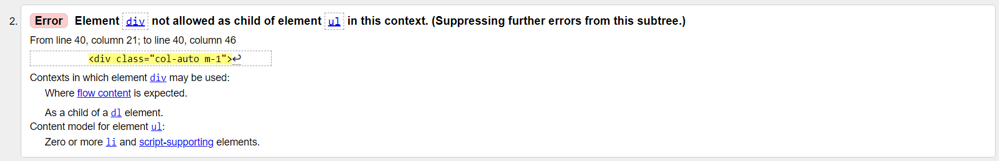

<br>

- **CSS:** Validated using [W3C CSS Validator](https://jigsaw.w3.org/css-validator/).Reports below:
<br>
  - <a href="https://jigsaw.w3.org/css-validator/validator?uri=https%3A%2F%2Fultimate-planner-c321a2415a86.herokuapp.com%2F&profile=css3svg&usermedium=all&warning=1&vextwarning=&lang=en">**Landing Page**</a>
  - <a href="https://jigsaw.w3.org/css-validator/validator?uri=https%3A%2F%2Fultimate-planner-c321a2415a86.herokuapp.com%2Fregister&profile=css3svg&usermedium=all&warning=1&vextwarning=&lang=en" target="_blank">**Register Page**</a>
  - <a href="https://jigsaw.w3.org/css-validator/validator?uri=https%3A%2F%2Fultimate-planner-c321a2415a86.herokuapp.com%2Flogin&profile=css3svg&usermedium=all&warning=1&vextwarning=&lang=en" target="_blank">**Login Page**</a>
  - <a href="https://jigsaw.w3.org/css-validator/validator?uri=https%3A%2F%2Fultimate-planner-c321a2415a86.herokuapp.com%2Fadd-category&profile=css3svg&usermedium=all&warning=1&vextwarning=&lang=en" target="_blank">**Add Category Page**</a>
  - <a href="https://jigsaw.w3.org/css-validator/validator?uri=https%3A%2F%2Fultimate-planner-c321a2415a86.herokuapp.com%2Fedit-category%2F11&profile=css3svg&usermedium=all&warning=1&vextwarning=&lang=en" target="_blank">**Edit Category Page**</a>
  - <a href="https://jigsaw.w3.org/css-validator/validator?uri=https%3A%2F%2Fultimate-planner-c321a2415a86.herokuapp.com%2Fadd-goal&profile=css3svg&usermedium=all&warning=1&vextwarning=&lang=en" target="_blank">**Add Goal Page**</a>
  - <a href="https://jigsaw.w3.org/css-validator/validator?uri=https%3A%2F%2Fultimate-planner-c321a2415a86.herokuapp.com%2Fedit-goal%2F23&profile=css3svg&usermedium=all&warning=1&vextwarning=&lang=en" target="_blank">**Edit Goal Page**</a>
  - <a href="https://jigsaw.w3.org/css-validator/validator?uri=https%3A%2F%2Fultimate-planner-c321a2415a86.herokuapp.com%2Fdashboard&profile=css3svg&usermedium=all&warning=1&vextwarning=&lang=en" target="_blank">**Dashboard Page**</a>

- **Python:** linting was conducted using Flake8, with no significant issues identified apart from a few instances of lines exceeding the recommended length

[Back to top](#contents)


# 🌐 Deployment

  ### 📌 Local Deployment  
  1. Clone the repository from GitHub by clicking the "Code" button and copying the URL.
  2. Open your preferred IDE and start a terminal session in the directory where you want to clone the repository.
  3. Type `git clone` followed by the URL you copied in step 1 and press Enter.
  4. Navigate into the project directory using `cd [project_name]`.
  5. Create and activate a virtual environment:
      ```bash
      python -m venv venv
      source venv/bin/activate   # On macOS/Linux
      venv\Scripts\activate      # On Windows
      ```
  6. Install the required dependencies by typing:
      ```bash
      pip install -r requirements.txt
      ```
  7. Set up environment variables by creating an `.env` file in the root directory. See [Environment Variables](#environment-variables) for more details.
  8. Initialize the database:
      ```bash
      flask db upgrade
      ```
  9. Run the application:
      ```bash
      flask run
      ```
  10. Open the application in your browser using the link provided in the terminal (usually `http://127.0.0.1:5000`).

  ---

  ### 💜 Heroku Deployment
  1. Create a Heroku account at [https://heroku.com](https://heroku.com) if you don’t already have one.
  2. Log in to the Heroku dashboard and click "New" > "Create new app."
  3. Enter a unique name for your app and choose the appropriate region.
  4. In the "Deploy" tab, connect your GitHub repository to the app.
  5. Add the necessary buildpacks in the following order:
      - `heroku/python`
      - `heroku/nodejs`
  6. Navigate to the "Settings" tab and configure the required environment variables under "Config Vars":
      - **`PORT`**: 8000  
      - **`DATABASE_URL`**: Your PostgreSQL database URL.  
      - **`SECRET_KEY`**: A secret key for your application.  
  7. Enable automatic deploys from the "Deploy" tab and deploy the app manually by clicking "Deploy Branch."
  8. Once the deployment is complete, click "Open App" to access your live application.


  ### 📐 Environment Variables
    #### 📌 Local Environment:
    - Create a `.env` file in the root directory of the project and add the following environment variables:
        - **`DATABASE_URL`**: The URL for your PostgreSQL database.
        - **`SECRET_KEY`**: A random, secure secret key for the application.

    #### 💜 Heroku Environment:
    - Set the environment variables through the Heroku dashboard under "Config Vars" in the "Settings" tab:
        - **`PORT`**: 8000  
        - **`DATABASE_URL`**: The PostgreSQL database URL provided by the Heroku PostgreSQL add-on.  
        - **`SECRET_KEY`**: The secret key for your application.

    #### 🖇️ GitHub Pages Deployment
    1. Create a repository on GitHub if you haven’t already.
    2. Commit your code and push it to the GitHub repository.
    3. Navigate to the "Settings" tab of your repository.
    4. Scroll down to the "Pages" section and select a branch (usually `main`) and the root folder for deployment.
    5. Save the changes, and GitHub Pages will generate a link to access your application.

  [Back to top](#contents)


# 💻Technologies Used
I used the following technologies, platforms and support in building my project:
- The application was built in Python.
- [**edX**](https://www.edx.org/) modules/lessons aided my learning and many of the concepts learned were applied in this project.
- [**Harvard Online**](https://pll.harvard.edu/course/cs50-introduction-computer-science) lectures, shorts, problems set founded knowledge to develop the project.
- [**GitHub**](https://github.com/Cesargarciajr/) was used for the project repository and version control
- [**Visual Studio Code**](https://code.visualstudio.com/) - for IDE and editor of the code.
- [**Flask**](https://flask.palletsprojects.com/en/stable/) - framework to develop the app.
- [**Bootstrap**](https://getbootstrap.com/) - for design and choices.
- [**Coolors**](https://coolors.co/) - design color palette.
- [**Font Awesome**](https://fontawesome.com/) - for icons selections
- [**Heroku**](https://www.heroku.com/platform) - was used for application deployment.
- [**Elephant SQL**](https://www.elephantsql.com/) - for database.
- [**ScreenToGif**](https://www.screentogif.com/) - generate HERO gif of the readme file
- [**Google Chrome Lighthouse Developer Tool**](https://developer.chrome.com/docs/lighthouse/overview) - Test and report bugs and issues
- [**Db Diagram**](https://dbdiagram.io/) - flowchart used on readme file.
- [**CS50 AI**](https://cs50.ai/) - helped me better understand concepts and solve many issues as a tutor
- [**Chat GPT**](https://chatgpt.com/) - generate text, correct grammar errors

[Back to top](<#contents>)

# 🎖️Credits

  ### 🖋️ Content  
  - [**David J Malan**](https://www.linkedin.com/in/malan/)  - CS50 Professor
  - [**Harvard Online**](https://pll.harvard.edu/course/cs50-introduction-computer-science) lectures, shorts, problems set founded knowledge to develop the project.
  - [**edX**](https://www.edx.org/) modules/lessons aided my learning and many of the concepts learned were applied in this project.
  - [**W3 Schools**](https://www.w3schools.com/) - used for multiples researches and tutorials in HTML and CSS.
  - [**Stack Overflow**](https://stackoverflow.com) - used to clarify questions and collect answers.
  - [**Real Python**](https://realpython.com/python-pep8) - Also provide with clarity the solutions
  - [**CS50 AI**](https://cs50.ai/) - helped me better understand concepts and solve many issues as a tutor
  - [**Chat GPT**](https://chatgpt.com/) - generate text, correct grammar errors

 
[Back to top](<#contents>)

  ### 📸 Media
- [**Db Diagram**](https://dbdiagram.io/) - flowchart used on readme file.
- [**Bootstrap**](https://getbootstrap.com/) - for design and choices.
- [**Coolors**](https://coolors.co/) - design color palette.
- [**Font Awesome**](https://fontawesome.com/) - for icons selections
- [**ScreenToGif**](https://www.screentogif.com/) - generate HERO gif of the readme file

[Back to top](<#contents>)

---

# 🙏 Acknowledgments

## Acknowledgments

I would like to express my heartfelt gratitude to the entire **CS50 team**, especially **David J. Malan**, for their incredible dedication and passion for teaching. This project is a culmination of everything I have learned so far in the course, and it reflects the invaluable lessons and skills imparted throughout.

A special thanks to **Harvard University**, **Harvard Online**, and **edX** for making this transformative learning experience accessible. The journey through this project challenged me to think critically, solve problems creatively, and deepen my understanding of web programming with Python.

This project not only allowed me to apply my knowledge but also gave me the opportunity to explore designing and building a project from scratch, further solidifying my learning and appreciation for the art of programming.

By [**Cesar Garcia**](https://github.com/Cesargarciajr)


# <a href="https://pll.harvard.edu/course/cs50-introduction-computer-science" target="_blank"></a> THANK YOU!

[Back to top](#contents)
