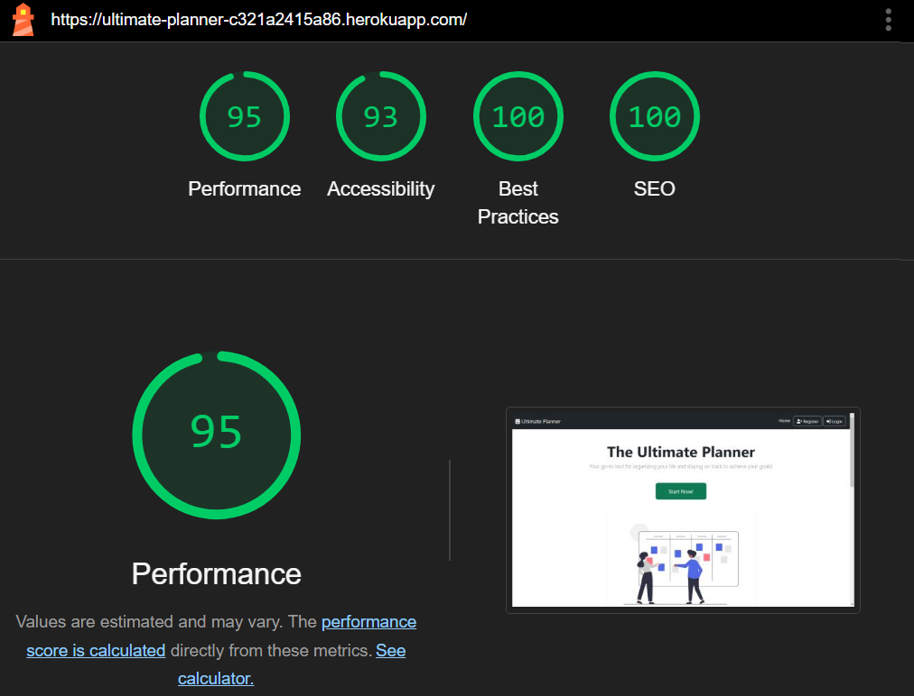
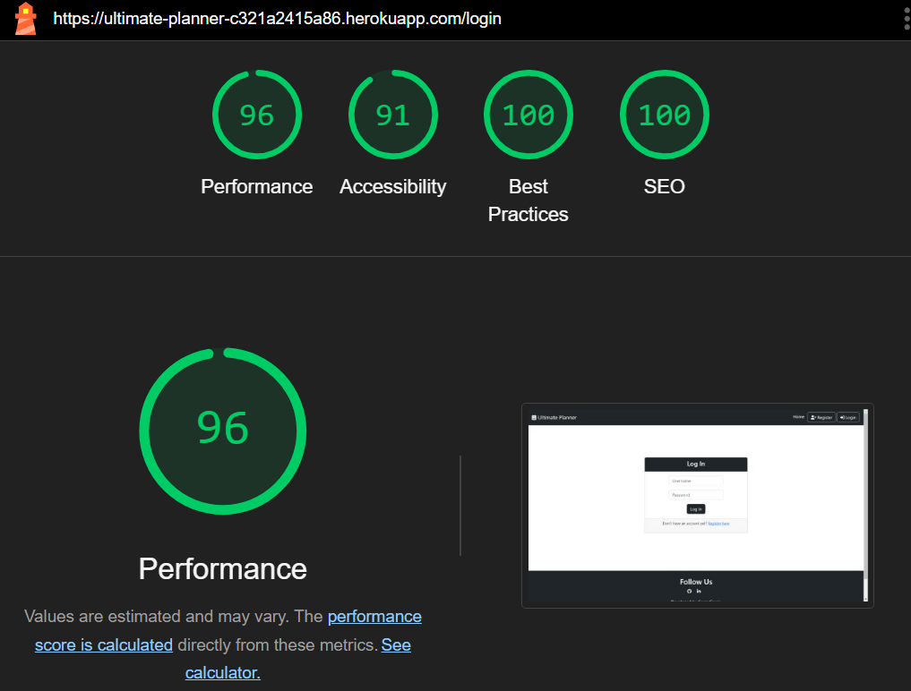

<h1 align="center"><a href="https://ultimate-planner-c321a2415a86.herokuapp.com/" target="_blank">The Ultimate Planner</a></h1> 

As the end of the year approaches, many people reflect on their accomplishments and begin setting plans and goals for the coming year. Inspired by this, I decided to develop **`The Ultimate Planner`** — a comprehensive tool designed to help users organize their lives, break down big goals, and stay on track with personalized categories and progress tracking.

One valuable lesson I’ve learned from programming is to break down complex challenges into smaller, more manageable tasks. Applying this same principle to goal-setting, my project enables users to plan effectively for a year, semester, or month. This intuitive platform promotes productivity, motivation, and organization by categorizing and tracking goals across areas such as Health, Finance, and Career.

The Ultimate Planner was developed as my **Final Project** for the **`CS50x 2024`**: **`Introduction to Computer Science`** course at: 
<br>
<h1 align="center">
  <a href="https://pll.harvard.edu/course/cs50-introduction-computer-science" target="_blank">
    
  </a>
</h1>

[**Live Demo: The Ultimate Planner**](https://ultimate-planner-c321a2415a86.herokuapp.com/)


# 📚 Contents

- [📚 Contents](#contents)
  - [✨ User Experience (UX)](#user-experience-ux)
    - [📜 User Stories](#user-stories)
    - [🛠️ Agile Methodologies](#agile-methodologies-with-github-kanban)
    - [🗃️ Database Flowchart](#database-flowchart)
    - [🎨 Design Choices](#design-choices)
    - [📐 Wireframes](#wireframes)
  - [🌟 Features](#features)
    - [🏠 Landing Page](#landing-page)
    - [📝 Register](#register-page)
    - [🔑 Log In](#login-page)
    - [📊 Dashboard](#dashboard-page)
    - [➕ Add Category](#add-category-page)
    - [🖊️ Edit Category](#edit-category-page)
    - [🎯 Add Goal](#add-goal-page)
    - [✏️ Edit Goal](#edit-goal-page)
    - [🚀 Future Features](#future-features)
  - [📢 Marketing Strategies](#marketing-strategies)
  - [🧪 Testing](#testing)
    - [🛰️ Overview](#️overview)
    - [⚒️ Manual Testing](#maunal-testing)
    - [🪲 Bugs and Issues](#bugs-and-issues)
  - [🌐 Deployment](#deployment)
  - [💻 Technologies Used](#technologies-used)
  - [🎖️ Credits](#credits)
    - [🖋️ Content](#content)
    - [📸 Media](#media)
  - [🙏 Acknowledgments](#acknowledgments)


___


# ✨ User Experience (UX)
  ### 📜 User Stories
  The GitHub Kanban and Issue Tracker tools were used to manage this project effectively. You can view the board [**here**](https://github.com/users/Cesargarciajr/projects/7).

  #### <u>Epic: Goal Management</u>
  1. **As a user,** I want to create and categorize my goals (e.g., Health, Finance, Career) so that I can keep them organized and easy to track.
  2. **As a user,** I want to break down my big goals into smaller milestones so that I can stay motivated and track my progress step by step.
  3. **As a user,** I want to assign a timeframe (e.g., year, semester, trimester, month) to each goal so that I can plan effectively within my schedule.
  4. **As a user,** I want to mark goals as "important" or "done" so that I can prioritize and see my accomplishments at a glance.
        
  #### <u>Epic: Planning and Progress Tracking</u>
  5. **As a user,** I want to track my progress visually so that I can stay motivated and measure how close I am to achieving my goals.
  6. **As a user,** I want to view all my goals and milestones in a clean, intuitive interface so that I can manage them effortlessly.
  7. **As a user,** I want the app to automatically save and organize my data so that I can focus on planning without worrying about losing my work.
        
  #### <u>Epic: Time Management</u>
  8. **As a user,** I want to create plans for specific timeframes (e.g., yearly, semester, trimester, monthly) so that I can adjust my focus depending on my goals.
  9. **As a user,** I want to see an overview of my goals by timeframe so that I can stay on track with my plans.
    
  #### <u>Epic: Productivity and Motivation</u>
  10. **As a user,** I want to categorize my goals by life areas (e.g., personal growth, professional success) so that I can balance different aspects of my life.
  11. **As a user,** I want to track both short-term and long-term goals so that I can work toward both immediate needs and future aspirations.
    
  #### <u>Epic: Onboarding and Guidance</u>
  12. **As a new user,** I want a simple and friendly introduction to the app so that I can quickly understand how to use it.

  [Back to top](#contents)


# 🕹️ Agile Methodologies with GitHub Kanban

GitHub Project Boards and Kanban methodology were employed to manage tasks efficiently. By visualizing the project through "To do", "In progress", and "Done" columns, the team maintained focus and ensured tasks moved through each stage systematically. You can view the board [**here**](https://github.com/users/Cesargarciajr/projects/7).


[Back to top](#contents)


# 🗃️ Database Flowchart

The database flowchart provided critical insights into the relationships between models and guided the application's development. Below is the chart created using [**dbdiagram.io**](https://dbdiagram.io/).


---

### 👤 **1. User Model**

<details>
  <summary><b>📖 Description:</b> Click to expand and view details about the User model.</summary>
  <br>
  The `User` model represents the users of the application. Each user has a unique ID, a username, and a hashed password for authentication.

  #### 🏷️ **Attributes**
  - **`user_id` (Primary Key)**:
    - A unique identifier for each user.
    - Serves as the primary key for the `User` table.

  - **`user_name`**:
    - A string to store the username.
    - Marked as `unique=True`, ensuring no two users can have the same username.
    - Cannot be `NULL` because `nullable=False`.

  - **`password`**:
    - A string to store the hashed password for the user.
    - Cannot be `NULL` because `nullable=False`.

  #### 🤝 **Relationships**
  - **`categories`**:
    - Establishes a one-to-many relationship between `User` and `Category`.
    - A single user can have multiple categories.
    - `backref='user'` provides a way to access the `User` associated with a `Category`.
    - `lazy=True` ensures related categories are loaded only when explicitly accessed.

  #### 🧩 **Representation (`__repr__`)**
  - Returns a string representation of the `User` object, displaying the `user_id` and `user_name`.

</details>
<br>

---

### 📂 **2. Category Model**

<details>
  <summary><b>📖 Description:</b> Click to expand and view details about the Category model.</summary>
  <br>
  The `Category` model represents categories created by users to organize their goals. Each category is linked to a specific user and has a unique name and color.

  ### 🏷️ **Attributes**
  - **`category_id` (Primary Key)**:
    - A unique identifier for each category.
    - Acts as the primary key for the `Category` table.

  - **`category_name`**:
    - A string to store the name of the category.
    - Cannot be `NULL`.
    - Must be unique per user (enforced by `db.UniqueConstraint`).

  - **`category_color`**:
    - A string to store the color code of the category (e.g., `#FF5733` for orange).
    - Cannot be `NULL`.
    - Must be unique per user (enforced by `db.UniqueConstraint`).

  - **`user_id` (Foreign Key)**:
    - References the `user_id` in the `User` table.
    - Links each category to the user who owns it.
    - Cannot be `NULL`.

  ### 🔗 **Constraints**
  - **`unique_category_per_user`**:
    - Ensures a user cannot have two categories with the same name.
  - **`unique_color_per_user`**:
    - Ensures a user cannot have two categories with the same color.

  ### 🤝 **Relationships**
  - Each category belongs to a single **user** (via the `user_id` foreign key).
  - A category can have multiple **goals** associated with it.

  ### 🧩 **Representation (`__repr__`)**
  - Returns a string representation of the `Category` object, displaying the `category_id`, `category_name`, and `category_color`.


</details>
<br>

---

### 🎯 **3. Goal Model**

<details>
  <summary><b>📖 Description:</b> Click to expand and view details about the Goal model.</summary>
  <br>
  The `Goal` model represents individual goals created by users within specific categories. Each goal is linked to a category and a user, tracking details such as importance, completion status, and timeframe.

  ### 🏷️ **Attributes**
  - **`goal_id` (Primary Key)**:
    - A unique identifier for each goal.
    - Acts as the primary key for the `Goal` table.

  - **`goal_name`**:
    - A string to store the name of the goal.
    - Cannot be `NULL`.

  - **`goal_description`**:
    - A string to store a brief description of the goal.
    - Cannot be `NULL`.

  - **`goal_important`**:
    - A boolean indicating whether the goal is marked as important.
    - Defaults to `False`.

  - **`goal_done`**:
    - A boolean indicating whether the goal is marked as completed.
    - Defaults to `False`.

  - **`goal_timeframe_selection`**:
    - A string to specify the timeframe of the goal (e.g., "year", "semester").
    - Cannot be `NULL`.

  - **`user_id` (Foreign Key)**:
    - References the `user_id` in the `User` table.
    - Links the goal to the user who owns it.
    - Cannot be `NULL`.

  - **`category_id` (Foreign Key)**:
    - References the `category_id` in the `Category` table.
    - Links the goal to a specific category.
    - Cannot be `NULL`.

  ### 🤝 **Relationships**
  - Each goal belongs to a single **user** (via the `user_id` foreign key).
  - Each goal belongs to a single **category** (via the `category_id` foreign key).

  ### 🧩 **Representation (`__repr__`)**
  - Returns a string representation of the `Goal` object, displaying attributes like `goal_id`, `goal_name`, `goal_description`, `goal_important`, and `goal_done`.

</details>
<br>

---

### ⚙️ **4. Relationships Overview**

<details>
  <summary><b>📖 Description:</b> Click to expand and view details about the model relationships.</summary>
  <br>
  The relationships between the models establish a hierarchical structure for organizing data.

  ### **User → Category (1:N Relationship)**
  - A user can create multiple categories.
  - The `categories` relationship in the `User` model links it to the `Category` model.
  - The `user_id` foreign key in the `Category` model establishes this link.

  ### **Category → Goal (1:N Relationship)**
  - A category can contain multiple goals.
  - The `category_id` foreign key in the `Goal` model establishes this link.

  ### **User → Goal (1:N Relationship)**
  - A user can create multiple goals.
  - The `user_id` foreign key in the `Goal` model establishes this link.

</details>

---
### 🔍 Summary of Model Relationships

  - **User → Category**:
  - A user can have many categories.
  - A category belongs to one user.

  - **Category → Goal**:
    - A category can have many goals.
    - A goal belongs to one category.

  - **User → Goal**:
    - A user can have many goals.
    - A goal belongs to one user.

  This structure ensures clear organization of goals into categories while associating them with specific users. It maintains data integrity and scalability for managing multiple users and their respective goals and categories effectively.

---
<br>

# 🎨 Design Choices

The app design embraces simplicity and functionality, ensuring an intuitive user experience. Transitions are smooth and visually appealing. The design leverages [**Bootstrap**](https://getbootstrap.com/) classes for consistent styling.


Color palette designed by [**Coolors**](https://coolors.co/)

[Back to top](#contents)

---

# 📐 Wireframes
  - **Landing Page**:
    

  - **Dashboard**:
    

   - **Add Category/Goal**:
    

      [Back to top](#contents)
---

# 🌟 Features
  - #### 🏠 **Landing Page**
      

      [Back to top](#contents)

  - #### 📝 **Register Page**
      
      
      [Back to top](#contents)

  - #### 🔑 **Login Page**
      
      
      [Back to top](#contents)

  - #### 📊 **Dashboard Page**
      
      
      [Back to top](#contents)

  - #### ➕  **Add Category Page**
      
      
      [Back to top](#contents)

  - #### 🖊️ **Edit Category Page**
      
      
      [Back to top](#contents)

  - #### 🎯 **Add Goal Page**
      
      
      [Back to top](#contents)

  - #### ✏️ **Edit Goal Page**
      
      
      [Back to top](#contents)

  ### 🚀 **Future Features**
      
  [Back to top](#contents)


# 🧪 Testing
  ### 🛰️ Overview

  - The application was tested for responsiveness across various devices and screen sizes (refer to section: [Responsiveness Testing](#-responsiveness-testing)).
  - All HTML files were validated using the W3C Validator with no significant errors.
    - NOTE: Errors related to custom attributes or framework-specific tags (like Bootstrap, Flask templates, etc.) were ignored after review and deemed non-critical.
  - All Python code was checked using Flake8 for PEP8 compliance, ensuring clean and readable code.
  - The website was tested on major browsers including Chrome, Firefox, Safari, and Edge for consistent behavior.
  - All user flows were tested in-depth, including registration, login, dashboard navigation, goal and category creation, and form submissions.
  - Form validation was thoroughly tested to ensure error messages are displayed for invalid inputs and only valid data is accepted.
  - Lighthouse was used to test for Performance, Accessibility, Best Practices, and SEO, with improvements made to enhance scores where necessary.
  - WAVE was utilized to test for accessibility issues, and adjustments were made to improve usability for users with assistive technologies.
  
  [Back to top](#contents)

  ## ⚒️ Manual Testing

<details>
<summary>⚙️ Testing the core functionality of the application.</summary>

<br>

  | **Test**                 | **Action**                                                                                                      | **Expected Outcome**                                                                                     |
  |--------------------------|------------------------------------------------------------------------------------------------------------------|----------------------------------------------------------------------------------------------------------|
  | Homepage Load            | Navigate to `/` to check if the homepage loads properly.                                                        | The homepage should load without errors and display the `index.html` template.                          |
  | User Registration        | Submit the registration form with valid and invalid data.                                                       | Valid data creates a new user; invalid data (e.g., mismatched passwords) shows an appropriate message.   |
  | User Login               | Submit the login form with correct and incorrect credentials.                                                   | Correct credentials log the user in and redirect them to the dashboard; incorrect credentials display an error message. |
  | User Logout              | Log in and then navigate to `/logout`.                                                                          | The user session is cleared, and the user is redirected to the login page.                              |
  | Access Unauthorized Page | Attempt to access `/dashboard` without logging in.                                                              | User should be redirected to the login page with an appropriate error message.                          |

  [Back to top](#contents)

</details>
<details>
<summary>👤 User Model Testing - Verify the User model behavior and constraints.</summary>

<br>

  | **Test**                  | **Action**                                                                                 | **Expected Outcome**                                                                                     |
  |---------------------------|--------------------------------------------------------------------------------------------|----------------------------------------------------------------------------------------------------------|
  | Unique Username           | Attempt to register two users with the same username.                                      | The second attempt should fail with an appropriate error message.                                        |
  | Password Validation       | Attempt to register with mismatched passwords.                                             | The registration should fail, and a message should inform the user about the mismatch.                   |
  | Password Hashing          | Check the database to ensure stored passwords are hashed.                                  | Passwords should be securely hashed and not stored in plain text.                                        |
  [Back to top](#contents)
</details>
<details>
<summary>📂 Category Testing - Test the functionality of adding, editing, and deleting categories<</summary>

<br>

  | **Test**                  | **Action**                                                                                 | **Expected Outcome**                                                                                     |
  |---------------------------|--------------------------------------------------------------------------------------------|----------------------------------------------------------------------------------------------------------|
  | Add Category              | Submit the `add category` form with a valid category name and color.                       | The category is added to the database and displayed on the dashboard.                                    |
  | Duplicate Category Name   | Attempt to add a category with a duplicate name for the same user.                         | The submission should fail with an error message.                                                        |
  | Duplicate Category Color  | Attempt to add a category with a duplicate color for the same user.                        | The submission should fail with an error message.                                                        |
  | Edit Category             | Modify an existing category and submit the form.                                           | The category details are updated in the database.                                                        |
  | Delete Category           | Delete a category from the dashboard.                                                     | The category is removed from the database.                                                               |
  | Add Category Without Login| Attempt to access `/add-category` without logging in.                                      | User is redirected to the login page.                                                                    |

  [Back to top](#contents)
</details>
<details>
<summary>🎯 Goal Testing - Test the functionality of managing goals</summary>

<br>

  | **Test**                  | **Action**                                                                                 | **Expected Outcome**                                                                                     |
  |---------------------------|--------------------------------------------------------------------------------------------|----------------------------------------------------------------------------------------------------------|
  | Add Goal                  | Submit the `add goal` form with valid data.                                                | The goal is added to the database and displayed in the corresponding category on the dashboard.          |
  | Duplicate Goal Name       | Attempt to add a goal with a duplicate name under the same category and timeframe.          | The submission should fail with an error message.                                                        |
  | Invalid Timeframe Selection | Submit the `add goal` form with an invalid timeframe.                                    | The submission should fail with an error message.                                                        |
  | Edit Goal                 | Modify an existing goal's details and submit the form.                                     | The goal details are updated in the database.                                                            |
  | Delete Goal               | Delete a goal from the dashboard.                                                          | The goal is removed from the database.                                                                   |
  | Mark Goal as Done         | Toggle the `done` status of a goal.                                                        | The goal's status is updated, and the changes are reflected on the dashboard.                            |
  | Mark Goal as Important    | Toggle the `important` status of a goal.                                                   | The goal's importance is updated, and the changes are reflected on the dashboard.                        |
  | Add Goal Without Category | Submit the `add goal` form without selecting a category.                                   | The submission should fail with an error message.                                                        |
  | Add Goal Without Login    | Attempt to access `/add-goal` without logging in.                                          | User is redirected to the login page.                                                                    |

  [Back to top](#contents)
</details>
<details>
<summary>🔒 Authorization Testing - Ensure the application enforces proper authorization for restricted actions</summary>

<br>

  | **Test**                  | **Action**                                                                                 | **Expected Outcome**                                                                                     |
  |---------------------------|--------------------------------------------------------------------------------------------|----------------------------------------------------------------------------------------------------------|
  | Dashboard Access Without Login | Attempt to access `/dashboard` without logging in.                                    | User is redirected to the login page.                                                                    |
  | Edit Category by Non-Owner | Attempt to edit a category that belongs to another user.                                   | The user is shown an error message or redirected to the dashboard.                                       |
  | Delete Category by Non-Owner | Attempt to delete a category that belongs to another user.                               | The user is shown an error message or redirected to the dashboard.                                       |
  | Edit Goal by Non-Owner    | Attempt to edit a goal that belongs to another user.                                        | The user is shown an error message or redirected to the dashboard.                                       |
  | Delete Goal by Non-Owner  | Attempt to delete a goal that belongs to another user.                                      | The user is shown an error message or redirected to the dashboard.                                       |

  [Back to top](#contents)
</details>
<details>
<summary>📱 Responsiveness Testing - Ensure the app is responsive across devices</summary>

<br>

| **Test**                  | **Action**                                                                                 | **Expected Outcome**                                                                                     |
|---------------------------|--------------------------------------------------------------------------------------------|----------------------------------------------------------------------------------------------------------|
| Mobile Layout             | View the application on various screen sizes using browser developer tools.                | The layout adjusts appropriately, with no overlapping elements or content cut off.                       |
| Tablet Layout             | Test the application on a tablet-sized viewport.                                           | The layout adjusts appropriately for medium-sized screens.                                               |
| Large Screen Layout       | Test the application on a desktop or large screen.                                         | The layout adapts and utilizes available screen space efficiently.                                       |

[Back to top](#contents)
</details>

  ### 🗼Google Lighthouse tests

  <details>
  <summary> Landing Page</summary>
    
  </details>
  <details>
  <summary> Register Page</summary>
    
  </details>
  <details>
  <summary> Login Page</summary>
    
  </details>
  <details>
  <summary> Add Category Page</summary>
    
  </details>
  <details>
  <summary> Add Goal Page</summary>
    
  </details>
  <details>
  <summary> Dashboard Page</summary>
    
  </details>
---


## 🪲 Bugs and Issues
While developing, some sensitive keys were accidentally pushed to GitHub. However, they were promptly regenerated and securely added as environment variables on the Heroku platform. Any other bugs were troubleshooted and addressed while developing the application.

## 🛡️ Code Validation
- **HTML:** Checked via [W3C Validator](https://validator.w3.org/).
- **CSS:** Validated using [W3C CSS Validator](https://jigsaw.w3.org/css-validator/).
- **Python:** Linting performed using Flake8.

[Back to top](#contents)


# 🌐 Deployment

  ### 📌 Local Deployment  
  1. Clone the repository from GitHub by clicking the "Code" button and copying the URL.
  2. Open your preferred IDE and start a terminal session in the directory where you want to clone the repository.
  3. Type `git clone` followed by the URL you copied in step 1 and press Enter.
  4. Navigate into the project directory using `cd [project_name]`.
  5. Create and activate a virtual environment:
      ```bash
      python -m venv venv
      source venv/bin/activate   # On macOS/Linux
      venv\Scripts\activate      # On Windows
      ```
  6. Install the required dependencies by typing:
      ```bash
      pip install -r requirements.txt
      ```
  7. Set up environment variables by creating an `.env` file in the root directory. See [Environment Variables](#environment-variables) for more details.
  8. Initialize the database:
      ```bash
      flask db upgrade
      ```
  9. Run the application:
      ```bash
      flask run
      ```
  10. Open the application in your browser using the link provided in the terminal (usually `http://127.0.0.1:5000`).

  ---

  ### 💜 Heroku Deployment
  1. Create a Heroku account at [https://heroku.com](https://heroku.com) if you don’t already have one.
  2. Log in to the Heroku dashboard and click "New" > "Create new app."
  3. Enter a unique name for your app and choose the appropriate region.
  4. In the "Deploy" tab, connect your GitHub repository to the app.
  5. Add the necessary buildpacks in the following order:
      - `heroku/python`
      - `heroku/nodejs`
  6. Navigate to the "Settings" tab and configure the required environment variables under "Config Vars":
      - **`PORT`**: 8000  
      - **`DATABASE_URL`**: Your PostgreSQL database URL.  
      - **`SECRET_KEY`**: A secret key for your application.  
  7. Enable automatic deploys from the "Deploy" tab and deploy the app manually by clicking "Deploy Branch."
  8. Once the deployment is complete, click "Open App" to access your live application.


  ### 📐 Environment Variables
    #### 📌 Local Environment:
    - Create a `.env` file in the root directory of the project and add the following environment variables:
        - **`DATABASE_URL`**: The URL for your PostgreSQL database.
        - **`SECRET_KEY`**: A random, secure secret key for the application.

    #### 💜 Heroku Environment:
    - Set the environment variables through the Heroku dashboard under "Config Vars" in the "Settings" tab:
        - **`PORT`**: 8000  
        - **`DATABASE_URL`**: The PostgreSQL database URL provided by the Heroku PostgreSQL add-on.  
        - **`SECRET_KEY`**: The secret key for your application.

    #### 🖇️ GitHub Pages Deployment
    1. Create a repository on GitHub if you haven’t already.
    2. Commit your code and push it to the GitHub repository.
    3. Navigate to the "Settings" tab of your repository.
    4. Scroll down to the "Pages" section and select a branch (usually `main`) and the root folder for deployment.
    5. Save the changes, and GitHub Pages will generate a link to access your application.

  [Back to top](#contents)


# 💻Technologies Used
I used the following technologies, platforms and support in building my project:
- The application was built in Python.
- [**edX**](https://www.edx.org/) modules/lessons aided my learning and many of the concepts learned were applied in this project.
- [**Harvard Online**](https://pll.harvard.edu/course/cs50-introduction-computer-science) lectures, shorts, problems set founded knowledge to develop the project.
- [**GitHub**](https://github.com/Cesargarciajr/) was used for the project repository and version control
- [**Visual Studio Code**](https://code.visualstudio.com/) - for IDE and editor of the code.
- [**Flask**](https://flask.palletsprojects.com/en/stable/) - framework to develop the app.
- [**Bootstrap**](https://getbootstrap.com/) - for design and choices.
- [**Coolors**](https://coolors.co/) - design color palette.
- [**Font Awesome**](https://fontawesome.com/) - for icons selections
- [**Heroku**](https://www.heroku.com/platform) - was used for application deployment.
- [**Elephant SQL**](https://www.elephantsql.com/) - for database.
- [**ScreenToGif**](https://www.screentogif.com/) - generate HERO gif of the readme file
- [**Db Diagram**](https://dbdiagram.io/) - flowchart used on readme file.
- [**CS50 AI**](https://cs50.ai/) - helped me better understand concepts and solve many issues as a tutor
- [**Chat GPT**](https://chatgpt.com/) - generate text, correct grammar errors

[Back to top](<#contents>)

# 🎖️Credits

  ### 🖋️ Content  
  - [**David J Malan**](https://www.linkedin.com/in/malan/)  - CS50 Professor
  - [**Harvard Online**](https://pll.harvard.edu/course/cs50-introduction-computer-science) lectures, shorts, problems set founded knowledge to develop the project.
  - [**edX**](https://www.edx.org/) modules/lessons aided my learning and many of the concepts learned were applied in this project.
  - [**W3 Schools**](https://www.w3schools.com/) - used for multiples researches and tutorials in HTML and CSS.
  - [**Stack Overflow**](https://stackoverflow.com) - used to clarify questions and collect answers.
  - [**Real Python**](https://realpython.com/python-pep8) - Also provide with clarity the solutions
  - [**CS50 AI**](https://cs50.ai/) - helped me better understand concepts and solve many issues as a tutor
  - [**Chat GPT**](https://chatgpt.com/) - generate text, correct grammar errors

 
[Back to top](<#contents>)

  ### 📸 Media
- [**Db Diagram**](https://dbdiagram.io/) - flowchart used on readme file.
- [**Bootstrap**](https://getbootstrap.com/) - for design and choices.
- [**Coolors**](https://coolors.co/) - design color palette.
- [**Font Awesome**](https://fontawesome.com/) - for icons selections
- [**ScreenToGif**](https://www.screentogif.com/) - generate HERO gif of the readme file

[Back to top](<#contents>)

---

# 🙏 Acknowledgments

By [**Cesar Garcia**](https://github.com/Cesargarciajr)


# <a href="https://pll.harvard.edu/course/cs50-introduction-computer-science" target="_blank"></a> THANK YOU!

[Back to top](#contents)
